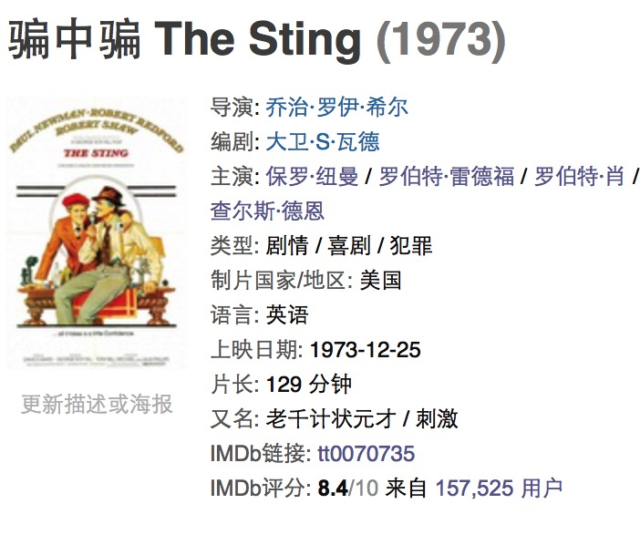

## Introduction

豆瓣电影显示IMDb当前评分，此插件意图来自个人实际需求，因平常经常在豆瓣看电影的评分、评论等，豆瓣虽显示出了IMDb的电影ID及链接，但每次都需要打开链接之后才能看到评分及详情，实际更多情况只是想看一下IMDb评分，与豆瓣评分做个对比，并非想看到所有的IMDb关于这个电影的详情，但目前没有发现Safari有这方面的插件，这样就有了这个插件。

此插件尽量与豆瓣原有的样式一致，并参考IMDb的展示结果，如：

